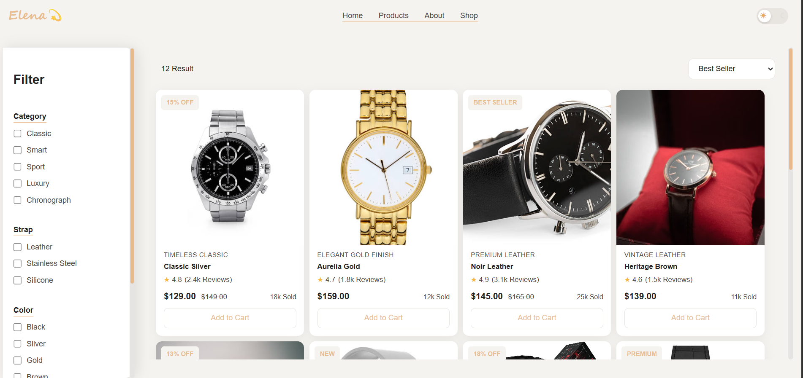
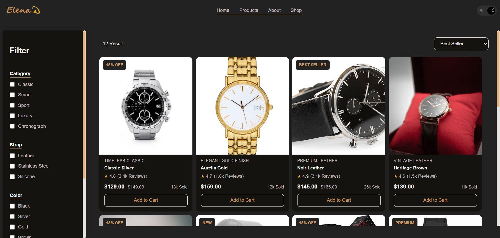
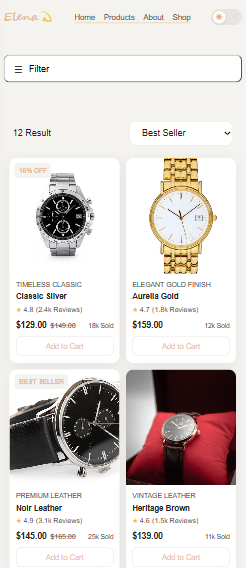

# Product Filter ⌚

A responsive product filtering page for watches, built with **HTML, CSS, and JavaScript**.

The project includes multiple filtering options, price sorting, a responsive mobile layout, and a Light/Dark Mode toggle.

## ✨ Features

* Filter products by:

  * Category
  * Strap
  * Color
  * Price range
* Sort products by:

  * Best Seller
  * Low to High Price
  * High to Low Price
* Light and Dark Mode
* Responsive design for mobile and desktop
* Mobile filter sidebar
* Product result counter
* Empty state when no products match the selected filters
* Product badges such as Sale, New, Best Seller, and Premium

## 🛠️ Built With

* HTML5
* CSS3
* JavaScript
* CSS Variables
* Responsive Design
* DOM Manipulation

## 📸 Screenshots

### 🖥️ Desktop — Light Mode




### 🖥️ Desktop — Dark Mode




### 📱 Mobile




## 🌐 Live Demo


[View Live Demo](https://elenahedayat.github.io/product-filter-page/)

## 📁 Project Structure

```text
filter_products/
│
├── images/
│   ├── p1.png
│   ├── p2.png
│   ├── ...
│   └── p12.png
│
├── index.html
├── style.css
├── script.js
└── README.md
```

## 🚀 How to Run

1. Clone the repository:

```bash
git clone https://github.com/elenahedayat/product-filter-page.git
```

2. Open the project folder.
3. Open `index.html` in your browser.

No additional installation or dependencies are required.

## 👩‍💻 Author

**Elena Hedayat**


[GitHub](https://github.com/elenahedayat)
